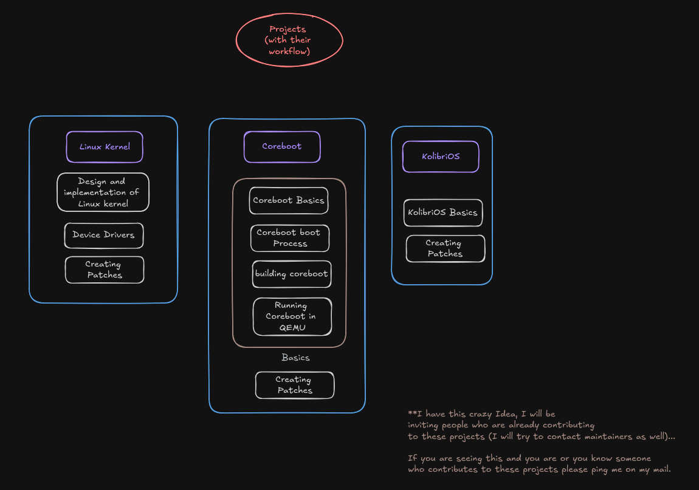

# **Binary Mavericks: Exploring Linux, Coreboot, and KolibriOS**

Welcome to **Binary-Mavericks**, a deep-dive series on operating system internals, where we explore the **Linux Kernel**, **Coreboot**, and **KolibriOS**. In this series, we'll break down the codebase, record introductory videos, and make contributions to each of these projects.

## **Series Overview**

This series is designed for developers, students, and enthusiasts interested in understanding the inner workings of operating systems. Each video and tutorial will cover different aspects of the Linux kernel, Coreboot firmware, and the lightweight KolibriOS.

### **Topics Covered**
- **Linux Kernel**
  - Basics of the Linux kernel architecture
  - Process management, memory management, and file systems
  - Writing and managing kernel modules
  - Networking, security, and real-time kernel features
  - Contributions and patch submissions

- **Coreboot**
  - Coreboot architecture and build process
  - Firmware initialization and payload integration
  - Coreboot’s interaction with hardware components
  - Contribution workflow for firmware enhancements and bug fixes

- **KolibriOS**
  - KolibriOS kernel and UI architecture
  - Writing and modifying applications in assembly (FASM)
  - System-level contributions and bug fixes

## **Resources**

### **Linux Kernel**
- **Books:**
  - *Linux Kernel Development* by Robert Love
  - *Linux Device Drivers* by Jonathan Corbet, Alessandro Rubini, and Greg Kroah-Hartman
- **Documentation:**
  - [Linux Kernel Documentation](https://www.kernel.org/doc/html/latest/)

### **Coreboot**
- **Documentation:**
  - [Coreboot Developer Documentation](https://doc.coreboot.org/)
  - [Coreboot GitHub Repository](https://github.com/coreboot/coreboot)

### **KolibriOS**
- **Documentation:**
  - [KolibriOS Developer Resources](https://wiki.kolibrios.org/wiki/Main_Page)
  - [KolibriOS Source Code](https://github.com/kolibrios)

## **Contributions**

Contributions to Linux, Coreboot, or KolibriOS will be covered throughout the series. Here's how you can get started:

- **Linux Kernel:** Learn how to contribute via the Linux Kernel Mailing List (LKML) and follow their contribution guidelines.
- **Coreboot:** Review the Coreboot contribution process through Gerrit and their developer community.
- **KolibriOS:** Use Subversion (SVN) or GitHub to contribute to KolibriOS, focusing on bug fixes or new applications.

## **Community & Discussions**

Join the community discussions and contribute to the development of these projects by engaging in their respective forums, mailing lists, and IRC channels.

- **Linux Kernel**: [Linux Kernel Mailing List](https://lkml.org/)
- **Coreboot**: [Coreboot Developer IRC](https://doc.coreboot.org/discuss.html)
- **KolibriOS**: [KolibriOS Forums](http://board.kolibrios.org/)

